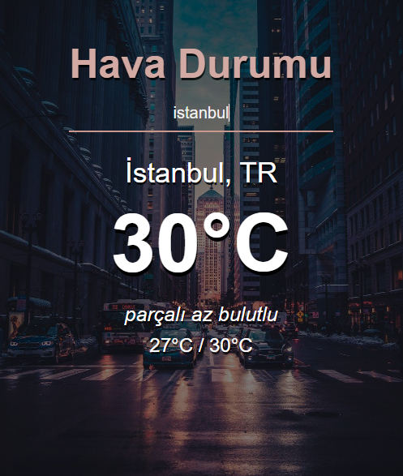

## Weather App

Bu proje, **JavaScript** ile **OpenWeather API**'sini kullanarak güncel hava durumu bilgilerini alma ve kullanıcıya sunma amacıyla yapılmıştır. Kullanıcıdan alınan şehir adı ile API'ye istek atılarak, hava durumu bilgileri alınır ve kullanıcıya estetik, kullanıcı dostu bir arayüz aracılığıyla gösterilir.

### Screenshots

### Nasıl Çalıştırılır

1. Öncelikle bu depoyu klonlayın veya ZIP dosyası olarak indirin.
2. Proje klasöründe bulunan `index.html` dosyasını bir tarayıcıda açın.
3. Uygulamayı kullanmak için şehir adını girip ENTER tuşuna basabilirsiniz.

### OpenWeather API Entegrasyonu

Bu projede, OpenWeather API'sini kullanarak gerçek zamanlı hava durumu verilerini alıyoruz. API anahtarınızı almak için [OpenWeather](https://openweathermap.org/) adresine gitmeniz ve ücretsiz bir hesap oluşturmanız gerekmektedir.

***NOT:*** API anahtarınızı `script.js` dosyasında ilgili yere eklemeyi unutmayınız.